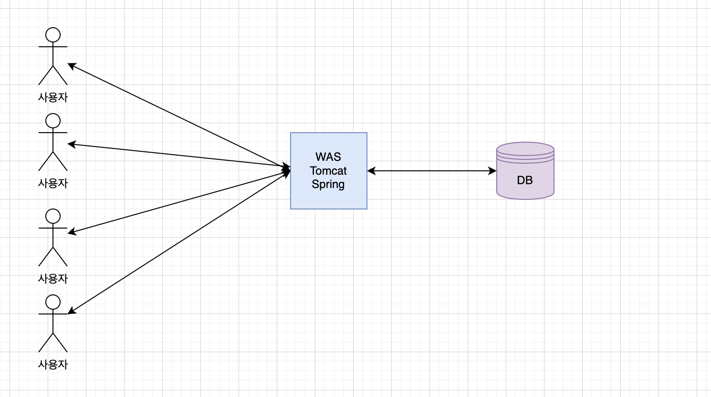

# 개선

이 글에서는 내가 유튜브 서버의 미디어 도메인을 맡으면서 어떻게 구조를 개선시켜 나갔는지 설명한다.

# 내가 맡은 미션

내가 이번 프로젝트에서 맡은 역할은 다음과 같다.

- 유튜브에서 가장 핵심이 되는 동영상 스트리밍 도메인을 담당한다.
- 유튜브 서버에서 관리되는 정적 리소스들을 관리한다.

이번 글에서는 동영상 스트리밍을 구현하며 구조적인 관점에서 개선한 점을 기록해 두려고한다.

# 1. 초기 서버 구조

사실 구조랄 것도 없는 구조이다. 팀원들 중 배포나 이런 배포 아키텍쳐에 대한 지식을 가지고 있는 팀원이 없었기 때문에, 그저 단순하게 하나의 spring boot 서버를 구상했었다.

내부적으로 domain을 나누어 작업하는 아주 기본적인 구상을 하고 프로젝트를 진행을 하였다.

# 2. 여러가지 문제 발생 : 미디어 서버의 분리

이렇게 설정을 하고 비디오 스트리밍에 대한 프로토 타입을 작성하였는데, 정말 다양한 문제가 있음을 알 수 있었다. 문제는 다음과 같다.

## 👉 마주한 문제들

### 비디오 인코딩에 너무 많은 시스템 리소스가 소모된다.

일반적으로 스프링으로 많이하는 controller - service - dao - db 로 대표되는 로직과는 달리, 동영상을 인코딩하고 파일 시스템을 관리하는 로직은 정말 많은 cpu burst를 포함하는 작업이었다.

우리의 서버 스펙이 1코어 1GB 메모리라는 안좋은 환경으로 예정이 되어있었기 때문에 최대한 효율적으로 만드려고 했다.

또 미디어 도메인의 작업이 시스템 전체에 영향을 미치게 되면, 전체 도메인의 작업이 동시에 느려지므로, 이는 큰 문제였다

### 정적 파일처리는 상당한 IO Blocking을 포함한다.

나의 로직을 설계하면서 든 생각은 이 미디어를 다루는 로직이 생각보다 너무 많은 IO작업을 포함하고 있다는 것이다. 일단 다루는 파일 자체가 동영상 파일이다 보니, 파일 자체의 용량이 매우 컸다.

또한 영속성 장치로의 IO작업은 메모리나 CPU의 처리속도보다 느린 것은 매우 자명한 사실이었다. 따라서 나의 로직을 처리하게 되면, 요청-응답 간 IO 블로킹이 상당시간 걸릴것이라고 예측할 수 있었다.

미디어 도메인는 쓰레드의 대부분을 blocking에 허비 하고 있다.

Tomcat은 쓰레드풀 기반으로 여러 요청을 동시에 처리하기 때문에, 쓰레드 생성에 들어가는 비용 커지게 되고, 생성된 쓰레드가 대부분 블로킹을 위해서만 소모될 것이라고 예상할 수 있었다.

### 협업 관점의 문제

나의 로직 안에는 파일 시스템에 직접 접근하거나, 시스템 커널을 직접 사용하는 부분이 많았다. 그러다 보니 여러 문제점이 생겼다.

- 코드, 테스트를 돌리려면, 각 협업자의 컴퓨터에 아키텍쳐에 맞는 커널을 설치해야한다.
- 각 운영체제별로 파일 주소를 관리하는 방법이 다르다.(윈도우와 unix기반의 파일 패스는 호환이 되지 않는다)
- 나의 코드를 로컬에서 돌리게되면 협업자의 로컬 스토리지에 접근해서 작업을 해야되는데 이는 상당한 부담이었다.
- 팀원 상당수가 아직 실력이 부족하기 때문에, 다양한 설정을 하기가 어려웠다.

길게 나열했지만, 한마디로 말을 하자면, 나의 도메인의 로직들은 시스템에 직접적으로 종속되는 부분이 많아서 협업할 때 문제가 많았다.

### 스케일 업(수평적 확장)의 문제

만약 나중에 성능을 올리기 위해 서버를 여러개를 두고 로드 밸런싱을 하게 된다면, 상당히 비효율적이게 될거라고 생각을 하게 되었다.

분명히 서버를 늘리는 이유는 시스템 리소스를 많이 소모하는 미디어 도메인 때문일 것인데, 이 로직이 하나의 서버에 합쳐져 있다면, 별로 확장이 필요없는 다른 도메인들까지 함께 딸려오게 되므로 확장할 수록 비효율적일 것이라고 생각하게 되었다.

## 👉 문제의 해결

그래서 난 결국 서버를 분리하기로 마음을 먹었다.

미디어 서버를 별도의 서버로 분리하고, 본 서버와는 API를 통해 통신하는게 낫다고 생각이 들었다. 이로 인해 얻는 장점은 다음과 같았다.

- 스케일업이 자유롭다
- 협업이 용이하다.
- 더 효율적인 설계를 위해 자유롭게 기술스택을 활용할 수 있다.

미디어 서버를 분리했다.

# 3. 부하를 줄이기 위한 노력 1 : 웹서버(nginx) 도입

그 다음 생각한 것이 web server였다. 과연 정적파일을 단순하게 응답할 때도 WAS의 높은 성능이 필요한가 였다.

사실 단순한 파일 서빙의 경우 웹서버가 담당하는 것이 낫다고 생각을 하였다. 그래서 웹서버를 사용해 리버시 프록시 기능을 구현했다. 도입하며 기대한 효과는 다음과 같다.

- 미디어 도메인의 단순 파일 서빙 기능을 웹서버로 넘기면서 WAS의 부하를 줄인다.
- 반복되는 정적 컨텐츠는 캐싱을 통해 성능을 높인다.
- 추후 서버를 여러개로 확장 할 때, 로드밸런서로서 활용할 수 있다.

내부에 웹서버를 두어 정적파일 서빙 역할을 분리하고, 캐싱이 용이하도록 하였다.

서버 볼륨을 각 도커 이미지에 볼륨 마운트 시키고, WAS서버는 정말 비디오 인코딩이나 복잡한 로직 처리만 담당하도록 하였다.

그리고 Nginx는 공유된 볼륨에서 동영상 파일이나, m3u8 플레이리스트, 썸네일 파일같이 큰 규모의 정적 파일들을 서빙하도록 역할을 분리시켰다.

물론 나의 경우에는 하나의 서버에 집어 넣었지만, Nginx를 별도로 분리시켜도 되고, 저 볼륨 마운트 된 스토리지를 다른 CDN같은 서비스로 바꿀 수도 있다.

결과적으로 다음과 같은 역할 분담이 이루어 졌다.

### Nginx

- 정적파일 서빙
- 프록시/캐싱

### Spring Webflux (WAS)

- 인코딩
- 정적파일 생성/저장
- 인코딩 상황 중계 등 복잡한 로직

리버스 프록시를 두고, 캐싱을 하도록 하여 성능을 개선하였다.

# 4. 부하를 줄이기 위한 노력 2: 이벤트 루프와 비동기 처리

그래도 남은 문제점이 있었다.

나의 로직의 대부분이 IO 블로킹이 포함되어 있고, 서버의 스펙이 좋지 못하다는 것이다. 서버의 스펙이 1Gb 메모리와 1Core cpu 였는데, 이 마저도 ARM기반이었다. 

만약 기존의 톰캣 기반으로 설계한다면, 계속해서 늘어나는 쓰레드를 버티기 힘들다고 생각하였다. 또한 다음과 같은 문제점도 있었다.

- 싱글 코어 이기 때문에, 많은 양의 쓰레드가 그다지 효율적이지 않을 것이다.
- 쓰레드가 많아지면, Context Switching 비용과 쓰레드 생성비용이 급격히 늘어날 것이다.
- 대부분이 블로킹 작업이고, 그 블로킹 시간동안 연산 리소스를 매우매우 많이 소모한다.(인코딩 작업)
- 인코딩 요청이 많이 들어오면, 시스템이 더 느려질 것이고, 이는 인코딩 처리를 더 느리게 만드므로, 요청이 더욱 적체되게 만들어 악순환이 반복된다.

요청이 늘어나면, 인코딩 작업이 더 오래걸리고, 이는 문맥 전환비용을 너무 높인다.

따라서 기존의 쓰레드 풀 방식으로는 한계가 있다고 생각을 하였다. 그래서 아래 목표를 잡았다.

- 인코딩 요청이 오면, 큐에 등록하고, 즉시 확인응답(완료응답이 아니라)를 보낸다.
- 별도로 제한된 쓰레드 풀을 생성하고, 한번에 실행될 수 있는 인코딩 작업 수를 제한한다.
- 대기 중인 작업은 가벼운 인코딩 주문 객체로 만들어 큐에 저장한다.
- 쓰레드를 조금 더 효율적으로 사용하자.

위와 같은 사항을 만족시키기 위해 WebFlux를 도입하고 새로운 방식으로 서버를 설계하기 시작했다.

WebFlux를 선택한 한가지 추가적인 이유가 있었는데, 미디어 서버의 주요 API중 하나인 진행 상황을 SSE로 BroadCast하는 작업을 조금더 효율적으로 처리하기 위함 이었다.

WebFlux도입과 시스템 설계

이를 통해 얻을 수 있는 장점은 다음과 같았다.

- Non-Blocking 이벤트 루프를 도입해서 쓰레드를 생성하지 않고도 빠르게 응답할 수 있었다. → 인코딩이 적체되어 다른 가벼운 응답이 안가는 상황을 방지 할 수 있다.
- Bonded Thread Pool은 시스템 코어의 두배까지만 생성되도록 하여 과도한 쓰레드 경쟁 방지, 악순환 예방
- 파일(비디오)을 그대로 메모리에 올려 놓는 것이 아니라, 일단 파일 시스템에 원본을 저장하고, 경로(String)만 큐에 등록하여 메모리를 절약할 수 있다.

가장 핵심은, 싱글 코어에 사양이 많이 떨어지는 서버에서 상당히 고효율로 로직들을 돌릴 수 있었다는 것이다.

# 5. 인코딩 작업과 파일 저장 작업 쓰레드 분리

이렇게 개선한 서버 로직인데도 아직 많이 부족했다. 다음과 같은 문제가 발생했다.

- 동영상 POST요청을 연속해서 2개 이상 보내면, Connection Timeout이 발생했다.

맨 처음에는 서버의 사양이 부족해서 그러겠구니 하고 넘어갔지만, 계속해서 생각하다 보니 문제점을 발견할 수 있었다. 나의 비디오 저장로직은 다음과 같은 절차를 따른다

1. 요청을 받는다
2. 요청을 검증한다. (필드나, 파일의 형식이나 등)
3. 파일을 저장한다. (메모리 → 파일 시스템)
4. 저장된 파일의 경로를 포함한 인코딩 요청서 (화질, 오디오 여부 등)을 작성해서 큐에 삽입한다.
5. 순서가 되면 쓰레드를 배정받고 인코딩을 수행한다.

문제는 파일을 저장하는 로직과 인코딩을 하는 로직이 모두 Bounded 쓰레드풀에서 같이 대기를 한다는 것이었다.

인코딩 작업은 평균적으로 시간을 많이 잡아먹고, 파일 저장 작업은 비교적 매우 빠르게 끝났다. 따라서 다음과 같은 생각을 하게 되었다.

> Bounded 쓰레드 풀에 동영상 인코딩 작업이 모두 들어가고 나면, 파일 저장로직이 대기를 하느라 요청이 TimeOut 되는 것이 아닐까?
> 

상당히 합리적인 의심인 것이, 나의 서버 코어 수는 1개이고 따라서 2개짜리 쓰레드 풀이 생성이 될텐데, 그렇다면 실험적으로 얻은 최대 2개 인코딩이라는 수치가 들어맞았다. (2개의 쓰레드가 점유당했으므로)

따라서 다음과 같이 개선하였다.

개선된 시스템, 더 이상 요청에 대한 지연이 발생하지 않는다

인코딩 작업만을 위한 Bounded 쓰레드 풀을 별도로 생성한 후, 인코딩 작업에만 사용하도록 배정하였다.

이로써 인코딩 작업 쓰레드풀은 인코딩 작업만 진행하고, 나머지 프로그램에서 사용되는 블로킹 작업은 여기에 영향을 받지 않고 잘 돌아갈 수 있게 되었다.

직접 PostMan으로 연속해서 동영상 등록 요청을 10번 정도 보내 보았지만, 요청간 지연시간이 비슷하게 잘 처리되었다. (물론 약간의 지연은 발생했지만, 기존의 TimeOut에 비하면, 아무것도 아니었다.)

# 결과

이 글에서는 다른 부분은 작성하지 않고, 프로젝트의 구조에 관해서 개선한 부분을 위주로 작성하였기 때문에 다른 개선사항은 다른 글에 적도록 하겠다.

이번 프로젝트에서 로직이 아닌 이러한 서버의 배치나, 로직 분배, 시스템 설계 만으로 상당히 많은 개선을 이루었다.

맨 처음 WAS 하나만으로 전체 서버를 돌렸을 때는 하나의 인코딩 작업도 잘 처리하지 못하였지만, 여러번의 개선을 통해 1Gb 메모리와 1Core(Arm) CPU라는 열악한 서버환경에서도 무사히 돌아가는 서버를 만들었다.

# 비동기 인코딩 진행 상황 제공

동영상 인코딩을 비동기로 진행하다보니, 다음과 같은 상황이 생겼다. 사용자가 현재 동영상 인코딩 작업이 얼마나 진행될 수 있는지 어떻게 알 수 있지? 

나는 이를 해결하기 위해서, 서버 내부에 ConcurrentHashMap을 두어 해결 하였다.

인코딩 작업 마다 고유한 키 값을 생성하고, 그 내부에 Project Reactor의 Flux.Sink를 두어 BroadCast를 하도록 하였다.

ConcurrentHashMap을 사용하였기 때문에 엔트리마다 락이 걸리게 되어, 여러 쓰레드에서 동시에 Map을 조회하더라도 성능하락을 최소화하였다.

그렇게 하여, 동영상 작업이 접수되면, READY상태로 이벤트를 발급하고, 동영상 인코딩이 진행될 때는, ffmpeg의 로그를 파싱하여 백분율 형식으로 이벤트를 퍼블리싱 하였다.

이 퍼블리싱 한 이벤트는 SSE를 통해 클라이언트에게 지속적으로 전달하도록 설계하였다.

# 새로운 문제점과 다른 학습

이렇게 프로젝트를 진행하고 나니, 확실히 보는 눈이 많이 달라졌다. 기존에는 배포나, 협업 관점의 문제는 경험해 본적이 없었기 때문이다. 

하지만 이 프로젝트를 끝내고 나니, 근본적인 문제점이 많이 보였다.

## 이벤트 브로커의 필요성 - 서버간 통신

이 프로젝트를 진행하며 처음으로 서버간 통신을 하며 로직이 처리되는 마이크로서비스(?) 같은 방식을 처음 사용해 보았다. 하지만 상당히 많은 문제점이 보였다.

일단 서버간 의존성이 매우 커진다는 것이었다. 또한 API 서버가 이 큰 동영상 파일을 받아서 또 다른 서버에게 전달하는 과정이 너무 비효율적이었다.

이러한 방식으로 계속해서 진행하면 많은 비효율이 존재한다는 것은 단번에 알 수 있었다. 만약 서버가 두대가 아니라 많은 도메인이 있다면? 이건 뭐 상상하기도 싫다. 서로 커넥션이 얽히고 섥혀서 디버깅도 거의 불가능하고 서로의 ip주소나 사항을 고려해야하고, 문제점이 너무 많이 보였다.

## 이벤트 브로커의 필요성 - 중계로직

이 프로젝트를 처음 시작할 때만 해도 클라우드에 대한 지식이 전무했다. 하지만 서버에 올리고 하며 aws나 다른 클라우드 서비스에 대해 잠시 알아보게 되었는데, 완전히 다른 시야가 보였다.

내가 인코딩 로직을 제한하기 위해 별도의 쓰레드풀을 두어 처리한 것과는 다르게, 오토스케일링이나 로드밸런싱이나, 정말 더 탁월한 해결책이 다수 있었다.

## 동영상 파일의 처리

동영상 파일을 서버 자체에 저장하는것 또한 문제가 많다고 생각했다. 만약 사용자가 계속해서 늘어난다면? 이 모든 것을 하나의 파일 시스템에 저장할 것인가?

## 검색을 위한 동영상의 분석의 필요성

동영상을 검색하려고 하니 문제가 발생했다.

## WebFlux의 잘못된 도입

이제까지 WebFlux의 장점을 수두룩하게 써놓고 이제와서 잘못된 도입이라니?

일단 나의 로직 자체가 대부분이 블로킹 작업이기 때문에, WebFlux의 논블로킹 이벤트 루프의 장점을 전혀살리지 못했다. 실제로 대부분의 작업이 쓰레드 풀에 배정이 되어, 일반 서블릿 톰캣 기반의 서버와 다를바가 없었다.

또한 Reactor의 함수형 프로그래밍 방식은 정말 다른 시각을 주고 분명히 유용한 부분이 있었지만, 익숙하지 않아 유지 보수가 어렵고, 잘못 설계하면 전혀 그 장점을 가져가기 어려웠다. 또 함수형 프로그래밍이 무조건 우월한 프로그래밍이 아니라는 것도 알았다. 분명한 장단점이 있었다.

어떤 코드에서는 함수형 프로그래밍이 가독성을 올려준 반면, 반대의 경우도 많았다. 또 예외처리가 너무 힘들고, 예상하기 힘들다. 예외처리가 일반적인 프로그래밍과 다르기도 했고, 각각에 예외 콜백을 달아줘야하고, 전체적인 예외 처리 흐름을 보기가 어려웠다.

그다음 가장 중요한 문제는, R2DBC 의 성숙도 문제였다. R2DBC는 리액티브 진영에서 사용하는 논블로킹 데이터베이스 접근 도구이다. 논블로킹이 가장 큰 특징이다. 하지만, 정말 성숙도가 너무 부족했다. 특히 Hibernate같은 우람한 구현체가 있는 JPA와는 달리, 구현체들의 지원도 특정 개인이 하고 있는 경우가 많았고, 유지보수도 잘 되지 않았다. (일례로, Mysql 구현체의 경우 어떤 중국 유저가 담당하고 있었는데, git에 들어가 보면, 코로나로 인해 삶이 힘들어져서 유지보수가 힘들다고 적혀있다.) 심지어, 버전에 따라서는 exits문을 호출하면 무조건적으로 NumberFormatCasting 관련 예외가 발생했다. (Integer → Long) 그냥 하는수 없이, 예외처리를 하여 무시하도록 구현하였다.

또한 JPA같은 구현체에서는 엔티티에 왠만한 타입을 붙여도 다 자동으로 변환되어 실행되는 한편, 대부분 내가 컨버터를 달아줘야했고, 그래프 탐색이나, ManyToOne과 같은 연관관계 매핑도 존재하지 않았다. 그냥 말그대로 SQL번역기 같은 느낌.

그래서 나의 다음 프로젝트 부터는 왠만하면 기존 전통적인 스프링으로 작업을 할 예정이다. 단 블로킹 작업이 적고, 빠른 응답속도와 리소스를 효율적으로 사용해야하는 프로젝트라면 도입할만 하다고 느꼈다. 대신, 그때는 오라클 같이 R2DBC에 대한 구현체를 확실하게 지원해주는 DB를 선택하는게 중요해 보였다.

## 문제점의 해결방안 - 미래 공부방향

그렇다면 나의 로직 설계는 완전히 틀린게되었다.

- 사용자가 늘어나도, 저렇게 하나의 서버에서 갯수를 제한하며 실행할것인가?
- 만약 미디어 서버가 여러대 실행되면, ConcurrentHashMap을 공유하지 않으므로, 어떻게 동작하게 되는가?
- 각각의 이벤트를 어떻게 구독할 것인가?

이런 생각을 하고 나니, 나의 로직이 완전히 틀렸다는 것을 알 수 있었다.

그래서 다음과 같은 구조로 설계를 하는 것이 더 나을 것이라는 생각이 들었다.

- 인코딩 로직은 쓰레드 풀로 제한 하는 것이 아니라, 계속해서 배정될 수 있게 하고 대신 오토 스케일링과 로드 밸런싱을 통해 이를 제어한다.
- 비동기로 처리되는 인코딩의 진행상황은, 각각의 처리 서버에서 이벤트를 발행하도록 하고, 이를 구독한 서버에서 진행상황을 알려주는 식으로 관심사를 분리한다.
- 파일은 aws S3에 저장하도록 하고, 이 이벤트를 활용해서 인코딩 작업을 비동기로 트리거한다.
- 원본 파일과 같은 파일은 많이 접근하지 않으므로, 더 저렴한 저장소에 별도로 저장한다.
- 동영상 검색을 위해, 동영상을 낮은 화질로 압축한 버전을 따로 만들어, 임시 프록시 s3에 저장하도록 하고, 뒷단에서 동영상 분석 작업이나, 자막 작업 등을 처리한다.
- S3의 정적 파일들은 클라우드의 CDN 서비스를 통해 캐싱을 진행한다.

이러한 다양한 생각이 들기 시작했다. 기존의 단순한 데이터 베이스 입출력 기반에서는 생각하지 못했던 다양한 문제가 발생했다.

그래서 앞으로 공부 방향을 정했다.

- MSA, 클라우드 네이티브, 이벤트 드리븐 아키텍쳐
- 아파치 카프카
- 엘라스틱 서치
- 서버리스(aws lambda)의 활용

현재는 책을 사고, 여러가지 데모를 만들며 이 새로운 분야에 대해 더 공부하고 있다.

# 느낀점

유튜브 클론 프로젝트에서 동영상 스트리밍이나, 정적파일을 다루는 문제는 다들 처음 다루는 문제라 맡기를 꺼려했다.

나도 처음 해보는 미디어 도메인을 맡으며, 많은 것을 단시간에 공부했다.

- Reactor (Flux, Mono)
- Webflux
- Docker
- Nginx
- 배포, 네트워크
- hls 프로토콜
- ffmpeg

사실 중간에 시험기간을 제외하면 2달동안 학교 수업과 과제를 병행하며, 공부한거라 정말 쉽지 않았다. 하지만, 처음 배포를 해보고 처음 협업을 해보며, 정말 도움이 많이 되었고 더 넓은 시야를 가질 수 있었다.

특히 앞으로 msa나 이벤트 드리븐, 클라우드 네이티브를 공부할 때 단순히 핫한 기술이어서가 아닌, 분명한 이유와 동기를 얻은거 같아 매우 도움이 되었다.